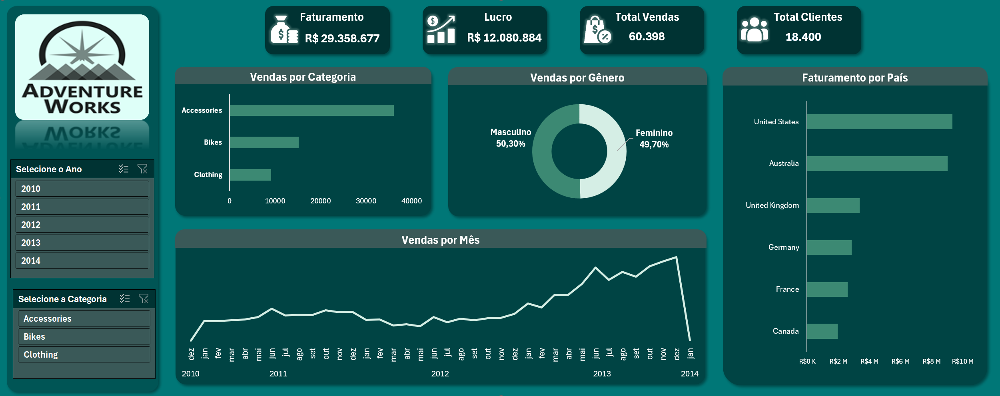

# 📊 Inteligência de Vendas Online: Dashboard de KPIs para Decisão Comercial
Análise da performance de vendas do canal Internet (AdventureWorks) com SQL Server + Excel.


> Projeto que transforma dados brutos de vendas em um painel de indicadores comerciais capaz de apoiar decisões sobre catálogo, sazonalidade, mercados prioritários e perfil de cliente — do banco de dados ao dashboard, usando T-SQL e Excel + Power Query.

---

## 📑 Sumário

- [Sobre o Projeto](#-sobre-o-projeto)
- [KPIs Desenvolvidos](#-kpis-desenvolvidos)
- [Preview do Dashboard](#️-preview-do-dashboard)
- [Tecnologias Utilizadas](#️-tecnologias-utilizadas)
- [Estrutura do Repositório](#-estrutura-do-repositório)
- [Como Reproduzir](#️-como-reproduzir)
- [Principais Insights](#-principais-insights)
- [Autor](#-autor)

---

## 📌 Sobre o Projeto

Este projeto simula um cenário real de análise de negócio para uma empresa de varejo online, utilizando o banco de dados de exemplo **AdventureWorks** (Microsoft) para o período de **2010 a 2014**. O objetivo foi transformar dados brutos de vendas do canal *Internet Sales* em indicadores de negócio (KPIs) claros e acionáveis, apresentados em um dashboard interativo no Excel, com cartões executivos, segmentações por Ano e Categoria, e identidade visual própria.

O fluxo do projeto segue uma pipeline típica de BI:

**SQL Server (extração e modelagem)** → **T-SQL (cálculo dos KPIs)** → **Power Query (conexão)** → **Excel (visualização e dashboard)**

### 🎯 Objetivo

Praticar e demonstrar habilidades essenciais de análise de dados:
- Escrita de consultas SQL para responder perguntas de negócio específicas
- Modelagem de indicadores (KPIs) relevantes para times comerciais
- Conexão de fontes de dados relacionais ao Excel via Power Query
- Construção de dashboards claros, visuais, interativos e de fácil leitura, com segmentação por Ano e Categoria

---

## 📈 KPIs Desenvolvidos

### Cartões Executivos (Visão Geral do Período)

| KPI | Descrição |
|---|---|
| **Faturamento Total** | Receita bruta acumulada no canal Internet entre 2010 e 2014 |
| **Lucro Total** | Receita menos custo total dos produtos vendidos |
| **Total de Vendas** | Quantidade total de pedidos/itens vendidos no período |
| **Total de Clientes** | Base total de clientes únicos que compraram no canal Internet |

### Análises Visuais (com Segmentação por Ano e Categoria)

| # | KPI | Pergunta de Negócio Respondida |
|---|-----|----------------------------------|
| 1 | **Vendas por Categoria** | Quais categorias de produto mais vendem no canal online? |
| 2 | **Vendas por Mês (2010–2014)** | Como a receita evolui ao longo do tempo? Há sazonalidade ou tendência de crescimento? |
| 3 | **Faturamento por País** | Quais mercados geram mais receita? |
| 4 | **Vendas por Gênero** | Existe diferença de comportamento de compra entre os perfis de cliente? |

Todos os visuais respondem dinamicamente aos filtros de **Ano** e **Categoria**, permitindo explorar o período completo (2010–2014) sem depender de recortes fixos.

Cada KPI foi validado primeiro por um script SQL individual na pasta [sql](./sql), etapa de análise exploratória que antecedeu a criação de uma VIEW consolidando todos os dados necessários para a análise no Excel.

Essa VIEW serviu como fonte única de dados: no Excel, ela foi explorada com tabelas dinâmicas — o equivalente visual da cláusula GROUP BY do SQL — a partir das quais foram construídos os gráficos e cartões do dashboard.

---

## 🖼️ Preview do Dashboard



---

## 🛠️ Tecnologias Utilizadas

- **SQL Server** — armazenamento e modelagem dos dados (AdventureWorks)
- **T-SQL** — extração e transformação dos KPIs
- **Excel + Power Query** — conexão com o banco, transformação e dashboard
- **Cartões de KPI** — indicadores executivos (Faturamento, Lucro, Total de Vendas, Total de Clientes)
- **Tabelas Dinâmicas / Segmentações (Slicers)** — filtros por Ano e Categoria com interatividade total
- **Git & GitHub** — versionamento e portfólio

---

## 📂 Estrutura do Repositório

```
adventureworks-sql-excel-dashboard/
├── sql/
│    ├── 1.definiçao_escopo_projeto.sql
│    ├── 2.vendas_internet_por_categoria.sql
│    ├── 3.receita_internet_por_mes_pedido.sql
│    ├── 4.receita_e_custo_internet_por_país.sql
│    ├── 5.total_vendas_internet_por_genero_cliente.sql
│    └── 6.VIEW_analise_KPIs.sql
│
├── excel/
│     └── Dashboard_AdventureWorks2025.xlsx
│
├── docs/
│     └── images/
│           └── dashboard_adventureworks2025.png
│
├── README.md
└── LICENSE
```

---

## ⚙️ Como Reproduzir

1. Baixe e restaure o banco **AdventureWorksDW2025** a partir do [repositório oficial da Microsoft](https://github.com/Microsoft/sql-server-samples/releases).
2. Execute os scripts da pasta [sql](./sql) no SQL Server Management Studio (SSMS) para validar os KPIs.
3. Abra o arquivo [Dashboard_AdventureWorks2025](./excel) no Excel.
4. Em **Dados > Consultas e Conexões**, atualize a string de conexão para apontar para a sua instância local do SQL Server.
5. Clique em **Atualizar Tudo** para carregar os dados e explore o dashboard — use os filtros de Ano e Categoria para navegar pelo período completo (2010–2014).

---

## 💡 Principais Insights

- No período de 2010 a 2014, o canal Internet gerou **R$ 29.358.677** em faturamento e **R$ 12.080.884** em lucro, resultando em uma margem de lucro de aproximadamente **41,2%**.
- Foram realizadas **60.398 vendas** para uma base de **18.400 clientes**, uma média de **~3,3 compras por cliente** no período analisado.
- A categoria **"Accessories"** lidera com folga as vendas por categoria, muito acima de **"Bikes"** e **"Clothing"**.
- **Estados Unidos** concentra o maior faturamento entre os países analisados, seguido por Austrália e Reino Unido; **Canadá** aparece com o menor faturamento do grupo.
- A distribuição de vendas por gênero está praticamente equilibrada: **Masculino 50,30%** vs. **Feminino 49,70%**.
- A série mensal mostra uma tendência de crescimento consistente entre 2010 e o final de 2013, com queda acentuada no início de 2014 — provavelmente referente a um mês com dados parciais.

---

## 👤 Autor

<div align="center">
<table>
  <tr>
    <td align="center">
      <b>Otávio Fabbro Machado</b><br/>
      Bacharel em Ciências Sociais (FFLCH-USP)<br/>
      Especialista em Ciência de Dados (ICMC-USP)<br/><br/>
      <a href="https://www.linkedin.com/in/otaviofabbrodata">
        
      </a>
      <a href="https://github.com/otaviofabbro">
        
      </a>
      <a href="mailto:otaviofabbro2@gmail.com">
        
      </a>
    </td>
  </tr>
</table>

</div>

---

## 📄 Licença

Este projeto está sob a licença MIT — veja o arquivo [LICENSE](./LICENSE) para mais detalhes.
